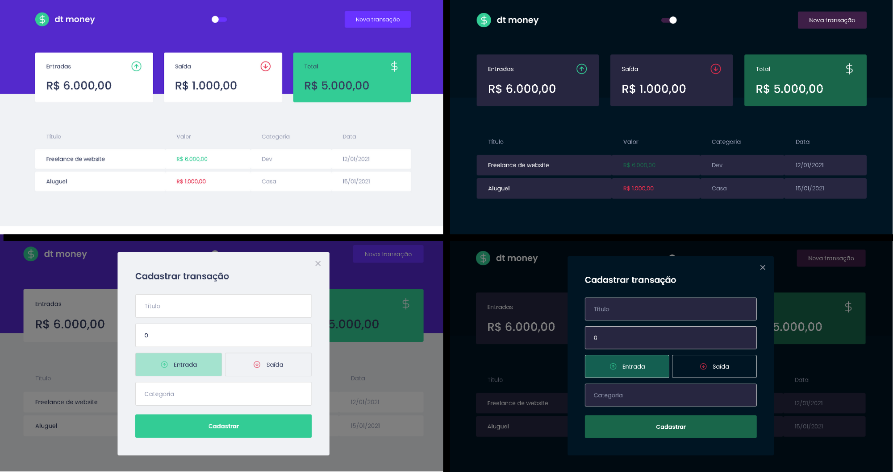

<h1 align="center"> Dtmoney_DarkMode </h1> 

<div align="center">
  
</div>

<div>
  
</div>

# About this Project

  It is an application to assist in financial control, the user can add their expenses and profits in a simple way.
  
# Functionalities

- Calculation of inputs, outputs and total.
- Register new transaction.
- Dark Mode.

# Getting Started

### Installing

**Cloning the Repository**

```
$ git clone https://github.com/LeonardoBrum0907/Dtmoney_DarkMode.git

$ cd Dtmoney_DarkMode
```

**Installing dependencies**

```
$ yarn
```

_or_

```
$ npm install
```

# Built With

- [ReactJS](https://nextjs.org/docs) - Build app using ReactJS and Typescript.
- [React-Modal](https://reactcommunity.org/react-modal/) - Modal Component.
- [Axios](https://axios-http.com/docs/intro) - HTTP Client.
- [MirageJS](https://miragejs.com/docs/getting-started/introduction/) - Fake API.
- [Styled-Components](https://styled-components.com/) - Styles.

